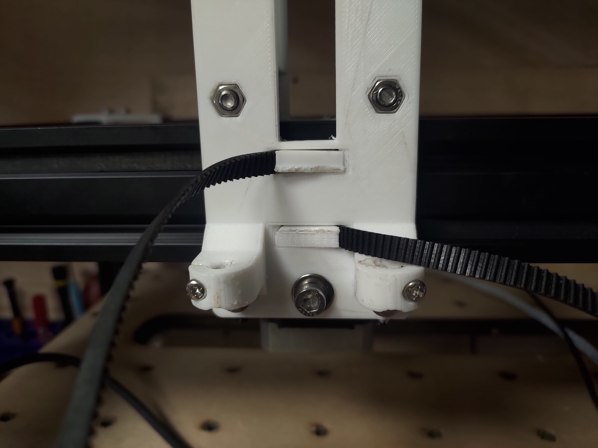
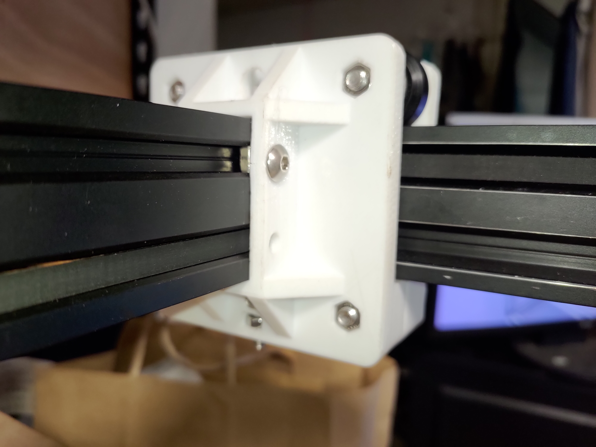

# AutomaticTestFilter-ATF 自動測試濾波器機台

This machine is for test fliter work, and the project is based on Openpnp

## 2023 Log

CAMERA HLODER

strain gauge

Openpnp

Test Vedio

New Structure Assembled

Because the original structure has some problem, so I desing new version

New Header

Transmission structure

The new packing method use magnet

Before cable is fly out of machine, so I added cable carrier to that protect it
 

The device is to hold pin header and use camera to correction it

Here is control box 
